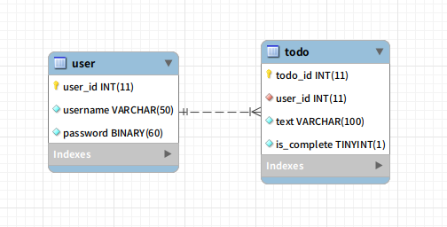

## Database 버전
MYSQL version = 5.7
 
## Database 생성
```SQL
CREATE DATABASE practice;
```

## user 생성 및 권한 부여
```SQL
CREATE USER 'username'@'%' IDENTIFIED BY 'password';
```

## practice datebase의 모든 권한 부여
```SQL
GRANT ALL PRIVILEGES ON practice.* TO 'username'@'%';
```

## Todo 엔티티
Todo에 필요한 속성
- Todo의 id(PK)
- User id(FK)
- 할일의 내용
- 할일을 끝냈는지 (시작 시간과 끝내는 시간으로 하는 것이 낫나?)

## User 엔티티
User에 필요한 속성
- User id(PK)
- password

## practice user로 로그인하고 practice 데이터베이스에서 테이블 생성.
```SQL
CREATE TABLE todo (
  todo_id INT(11) NOT NULL AUTO_INCREMENT,
  todo_text VARCHAR(100) NOT NULL,
  is_complete BOOLEAN NOT NULL,
  PRIMARY KEY ( todo_id ) 
);
```

password는 bcrypt의 해시 결과인 60자에 맞춤.
좀 더 효율을 원하다면 BMCF 를 통해 40자로 디코딩 가능하다고 함.  
salt 값을 테이블에 포함해야 되는가 했으나 해시결과 자체에 salt가 포함되어 없어도 된다고 생각됨.
```SQL
CREATE TABLE user (
  user_id INT(11) NOT NULL AUTO_INCREMENT,
  password BINARY(60) NOT NULL,
  PRIMARY KEY ( user_id )
); 
```

## 기존 todo 테이블의 FK 설정
user_id 컬럼 추가 (todo_id 컬럼 뒤에 추가)
```SQL
ALTER TABLE todo ADD user_id int(11) NOT NULL AFTER todo_id;
```
foreign key 설정
```SQL
ALTER TABLE todo ADD CONSTRAINT TodoUserId foreign key (user_id) references user (user_id);
```

## 결과 ERD



## 테스트용 데이터베이스 생성 및 권한 부여
root 계정으로 만들어야함.
```SQL
CREATE DATABASE practice_testing;
GRANT ALL PRIVILEGES ON practice_testing.* TO 'username'@'%';
```

## 테이블 복사
권한을 부여받은 계정으로..
```SQL
CREATE TABLE user LIKE practice.user;
CREATE TABLE todo LIKE practice.todo;
```

