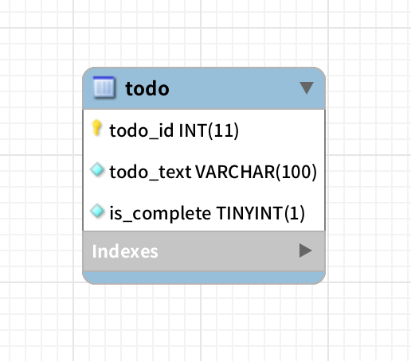

## 목표
데이터베이스를 생성하고 Todo 엔티티를 정의한다.

## Database 버전
MYSQL version = 5.7
 
## Database 생성
```SQL
CREATE DATABASE practice;
```
## user 생성 및 권한 부여
```SQL
CREATE USER 'username'@'%' IDENTIFIED BY 'password';
```
## practice datebase의 모든 권한 부여
```SQL
GRANT ALL PRIVILEGES ON practice.* TO 'username'@'%';
```

## Todo 엔티티
Todo에 필요한 속성
- 할일의 내용
- 할일을 끝냈는지 (시작 시간과 끝내는 시간으로 하는 것이 낫나?)

## practice user로 로그인하고 practice 데이터베이스에서 테이블 생성.
```SQL
CREATE TABLE todo (
  todo_id INT(11) NOT NULL AUTO_INCREMENT,
  todo_text VARCHAR(100) NOT NULL,
  is_complete BOOLEAN NOT NULL,
  PRIMARY KEY ( todo_id ) 
);
```

## 결과 ERD

