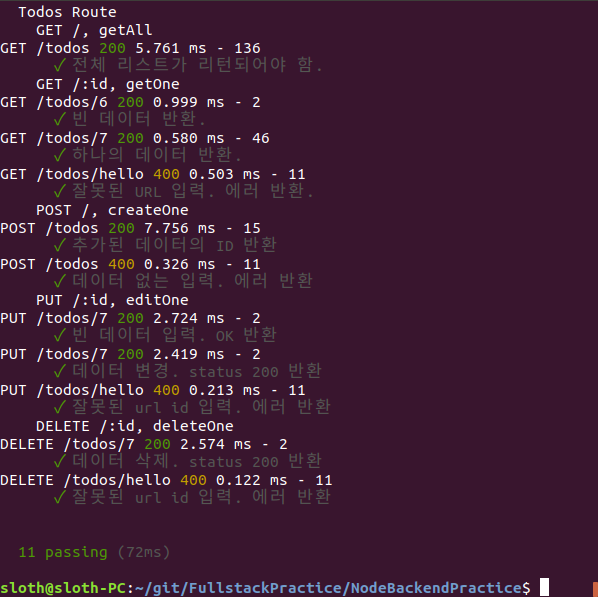

## testing 하기 전 필요한 것
test용 데이터베이스 만들기 ([database_v1 참고](https://github.com/jongho123/NodeBackendPractice/blob/master/doc/database_v1.md#%ED%85%8C%EC%8A%A4%ED%8A%B8%EC%9A%A9-%EB%8D%B0%EC%9D%B4%ED%84%B0%EB%B2%A0%EC%9D%B4%EC%8A%A4-%EC%83%9D%EC%84%B1-%EB%B0%8F-%EA%B6%8C%ED%95%9C-%EB%B6%80%EC%97%AC))

데이터베이스 계정 환경변수로 입력
```sh
$ export MYSQL_USER='db_user'
$ export MYSQL_PASSWORD='password'


# 매번 쓰기 귀찮다면 ~/.bashrc 밑에 위에 두 줄 입력하고
$ source ~/.bashrc
```

## test 실행
```sh
# 환경변수를 설정해놓지 않았으면 커맨드라인에 입력
$ MYSQL_USER=db_user MYSQL_PASSWORD=password npm test

# 위에서 환경변수를 미리 설정했다면
$ npm test
```

## 결과
;

